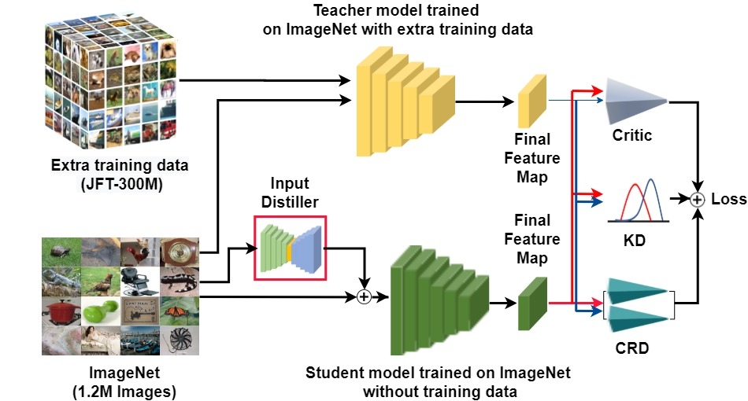

# Extra Representation Is All You Need.

## Overview of our framework.


## Clone
```
git clone https://github.com/anonymous-hub/ExRep
```

## Dataset
### ImageNet 2012
http://image-net.org/download

### CIFAR-10
We use torchvision built-in CIFAR-10.

## Download pre-trained model weights
The pretrained weights can be downloaded by running the file in dataset or [here]().

```
# Download the pre-trained weights
cd weights
bash download_weights.sh
cd ..
```

## Setup
```
pip install -r requirements.txt
```

## EfficientNet PyTorch
We utilize timm repository.
https://github.com/rwightman/pytorch-image-models/tree/master/timm

```
git clone https://github.com/rwightman/pytorch-image-models
pip install timm
cd pytorch-image-models
cp -r timm/ your-work-dir
```

## Contrastive Representation Distillation loss
We utilize the repository of CRD paper author [1].
https://github.com/HobbitLong/RepDistiller


## Demo (Evaluation)

## Reference
[1] Tian, Yonglong, Dilip Krishnan, and Phillip Isola. "Contrastive representation distillation." arXiv preprint arXiv:1910.10699 (2019).
